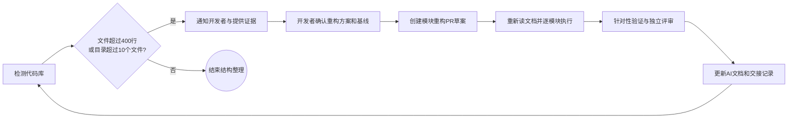

# Mako-Bot Agent 工作说明

## 当前优先级与授权边界

2026-10-06开发者先要求立即完成小鸟、传送、真实期刊，随后明确授权推送GitHub并在指定服务器拉取、部署测试；执行边界与回退见docs/deployment/2026-10-06.md。费用增强G3不推进，既有未完成独立评审保留待办；未指定真实QQ测试目标，不主动发送测试消息。
**重构方案由开发者最终决定。开发者已选择 A 基线并批准 R0–R16；在 mako-bot-refactor 隔离工作区执行。**
不得将之前对功能开发的授权解释为对本次重构方案的批准。
工作区存在上一阶段中断留下的未完成改动，不能当成稳定基线，不能自行 reset、stash、覆盖或删除。

## 每个模块开始前必须重新读取

即使在同一对话、同一 Agent 中，开始下一模块或恢复中断模块时，也必须再次读取：

1. 本文件 `AGENTS.md`。
2. `docs/agent/project.md`：项目概览、实际目录与前后端边界。
3. `docs/agent/development.md`：流程、风格、测试、安全实践。
4. `docs/refactor/plan.md` 与 `docs/refactor/modules.md`：开发者批准的方案及当前模块。
5. `docs/refactor/status.md`：批准记录、基线、进展和上一模块交接。
6. 待修改路径中更具体的 `AGENTS.md`（若有）及本模块关联代码。

开工记录必须写明本次读取时间、模块编号、允许修改路径、保留的行为契约和验证范围。
没有对应的批准记录时，只能继续只读调查、补充方案和说明文档；等待开发者确认后才能改业务代码。
已经批准的模块按记录执行，不重复索要相同批准；出现范围、数据格式或外部接口变化时再说明并确认。

## 结构检测规则

使用 `python scripts/audit_structure.py`；写报告加 `--write`，需要发现问题返回非零加 `--check`。
检查条件严格为：文件 **超过 400 个物理行**，或目录 **直接包含超过 10 个文件**。
Git 已跟踪和未忽略新文件均计入；空行、注释计入行数；二进制只计目录文件数。
依赖、缓存、构建产物和敏感文件正文不参与行数检测，具体口径以脚本及报告为准。
任何例外均需开发者明确批准并记入状态文档；不得删除注释、压缩代码、制造 `part1/part2` 来规避检测。

## 代码约束

- 依赖事实以当前代码、`pyproject.toml`、CI 为准，README 与历史讨论可能滞后。
- 保持 Python 3.10 和 3.13 兼容；不引入仅 3.11+ 才有的 API。
- 插件负责接入；服务负责逻辑；存储负责持久化；纯策略不注册 matcher、不取 NoneBot driver。
- 纯结构重构不顺带更改提示词、回复概率、配额、工具能力、Redis key/TTL 或 Dashboard JSON。
- 迁移导入时检查插件注册副作用、静态资源路径、打包清单、测试 monkeypatch 目标。
- 不自动提交、推送、部署、发送 QQ 消息；远程 PR 按开发者明确确认的发布范围执行。
- 不读取或打印 `.env`、令牌、真实群聊或私人画像；用脱敏样例和受控测试替身。

## 交付标准

每个模块交付：变更范围、旧到新路径、保留契约、必要验证结果、评审意见与处置、回退方法、文档更新。
测试只覆盖本模块风险与必要集成点，不对纯移动反复跑整套测试，也不为了行数写镜像测试。
独立评审用于检查边界和遗漏，不能代替运行必要检查。
子 Agent 可用时按既有用户要求使用 2–3 个互不重叠的工作单元和另一个评审 Agent；模块按依赖顺序验收。
额度不足时明确记录未评审，不能声称完成了多 Agent 评审，也不能无限重试。

## 文档入口

- [项目概览](docs/agent/project.md)
- [开发指南](docs/agent/development.md)
- [重构总体方案](docs/refactor/plan.md)
- [逐模块计划](docs/refactor/modules.md)
- [批准与执行记录](docs/refactor/status.md)
- [当前结构报告](docs/refactor/audit.md)
